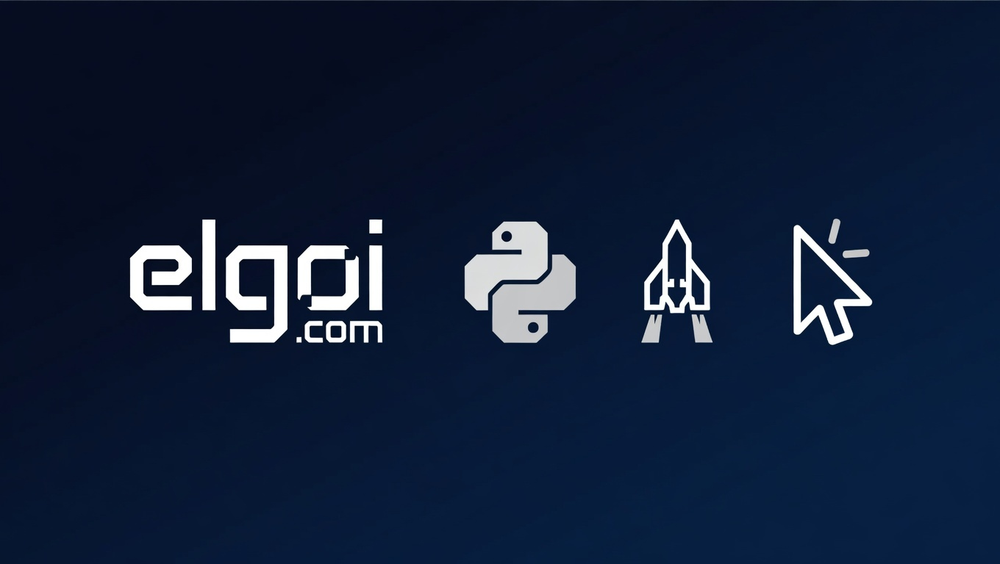

# 🚀 ELGOI — EVE Online Fleet & Character Manager

**ELGOI** is a character and fleet management tool for individual EVE Online players.
Named after a planetary system in the game — easy to remember, easy to find.

Built as part of the **[vibecodingmexico.com](https://vibecodingmexico.com)** experiment series,
where real projects are developed with LLM assistance and documented honestly — model, date, and all.

> ⚠️ This is a **two-phase project**. Sprint 1 is PHP. Sprint 2 is Go.
> Feature parity between phases is not guaranteed. That's intentional — it's part of the experiment.

---

## Why ELGOI?

I've been playing EVE Online since 2015 and have built tools against all three EVE APIs —
personal tools and alliance-level tools. That code isn't public for obvious reasons.

When someone asked me about using vibecoding for Python/Go, and I needed to properly test DeepSeek (deepseek python was TOTAL failure,
instead using part of kimi / gemini), the cleanest move was a new repository — no legacy entanglements, no permission conflicts.

The goal is to build something solid in PHP first, then migrate to Python/Go on a timeline that makes sense.
The workflow evolves based on my own needs as a player. This is a tool, not a demo.

ELGOI is also aimed at a specific market: players who have cPanel or a small VPS,
not people who want to run a 20-container infrastructure stack for a spreadsheet game.
In the future, I plan to offer hosted installation in exchange for PLEX.

Compared to tools like SEAT — which is too large and too complex to install for most players —
ELGOI is designed to run on a $5/month Vultr VPS or shared hosting without a fight.

> 📝 A WordPress development blog (no open comments) covering EVE development topics
> is planned for the future — for cases where the README and posts aren't enough.

---

## What is ELGOI?

A personal dashboard for EVE Online players who want to manage their characters,
track their fleet, and visualize their data — without depending on third-party platforms
they don't control.

It runs on shared hosting or, preferably, a **Vultr VPS at $5/month**.
No Composer. No dependency hell. Just PHP doing what PHP does best: running on anything.

The next phase will use a separate domain (elgoi.com) to serve live dashboards
and explore what Go can do in a real, adversarial-audience environment.

**Why EVE Online as a test bench?**
EVE players are, by definition, data auditors and resource optimizers.
If a Go dashboard survives EVE Online's community, it'll survive any corporate client.

---

## Project Phases

### Sprint 1 — PHP
- OAuth authentication via EVE Online ESI API
- Character dashboard (basic stats, assets, skills)
- Fleet management views
- Decremental skill dashboard — see at a glance which skills a pilot has that no one else does
- Inventory explosion screen — on-demand process, not automatic
- Installation without Composer — works on shared hosting and VPS

### Sprint 2 — Go *(planned, no fixed date)*
- Go 3.x rewrite
- Live dashboards served from [elgoi.com](https://elgoi.com)
- Deeper ESI API integration
- Real-world test of DeepSeek's Go capabilities

> PHP comes first because any standard server runs PHP with zero extra configuration.
> Go requires setup. Starting simple is not a compromise — it's engineering.
> Go migration will not begin until the PHP version is stable.

---

## 🧩 The Pocket 6 Concept

In EVE Online, pilots accumulate visible history — kills, transactions, contacts.
That history is accessible to other players and alliances. A pilot associated with
the wrong kill or the wrong ISK transfer can be blacklisted from corporations for months.
Some players maintain multiple pilots that, to an outside observer, appear completely unrelated.
That separation is intentional and strategic — it's called operational security, or opsec.

ELGOI tracks this through a `POCKET6` varchar field assigned to each pilot.
Each value represents an isolation group — pilots in different groups have no visible
connection to each other.

The name comes from the practical limit: **six groups is manageable, seven is the absolute maximum**
(conveniently matching EVE's seven-hangar limit). More than that becomes impossible to track
mentally, which defeats the purpose.

Example labels used in practice:
- `NOKIA` — screenshot and photography pilots
- `CLEAN` — no external contacts whatsoever
- `EXPER` — experimental characters

The labels are yours to define. The discipline is in keeping them few and meaningful.

Beyond opsec, **Pocket 6 also works as a report filter** — you can scope any report
to a single group without maintaining separate installations for each pilot set.

---

## 🔢 The Supergroup Concept

**Supergroup** is an integer field assigned to every pilot. Its purpose is report scope control.

With 90+ pilots under management, not all of them are relevant to every report.
A practical example: [VPS Corporation](https://evewho.com/corporation/98742383) currently holds
around 60 pilots created purely for aesthetic reference — interesting character visuals,
appearance ideas, inspiration for new builds. Useful to have. Useless in a daily operations report.

By default, every new pilot enters **Supergroup 1**.
To exclude a pilot from standard reports, move them to a different supergroup.
To see everything, query across all supergroups.
There is no hard limit on supergroup values — it's an integer.

Pocket 6 handles operational security separation.
Supergroup handles report noise.
They solve different problems and coexist in the same pilot record.

> ⚠️ Supergroup filtering is not yet implemented in all reports. It will be added progressively.

---

## 🛠️ Chosen Stack & Architecture

**Entry point:** PHP — what most people can run immediately on any server.
**Future:** Go 3.x — separate domain, separate phase, no fixed date.

**All code is procedural. No OOP. This is a conscious decision.**

The reason: compatibility with other systems already in production.
Fighting four different pilot data structures across systems is not a problem
worth creating. Procedural keeps the codebase readable, debuggable with LLMs,
and consistent across everything.

The database schema may look inefficient at first glance. It is not.
It is designed for cross-system compatibility with other tools already running in production.
Scopes and full database structure will be defined in their own document soon.

---

## Is This Vibecoding or Handcrafted?

Neither, exactly.

I've been writing EVE scripts since at least 2016. By 2023 I had a stable product
running in my own null-sec alliance, where I'm a regular member.

The need to test DeepSeek (already discarded)— and the complexity of go/Python — led me to take some shortcuts
to reduce time. When I use an AI, I say which one. I use web mode only;
paid API licenses like Kimi or Claude are not a practical option in Mexico.

Deepseek is BAD for these things . CUrrently checking Qwen and Kimi.

My usual tools:
- **Gemini** — better handling of APIs, main LLM for this project
- **Claude, Kimi, Grok** — specific tasks
- **DeepSeek** — Discarded, pending choose a new one, real test, specifically for Python/go

The core table structure and the update engine — the part that writes directly
to the database — are handwritten, with minor adjustments suggested by Gemini in June 2025.
LLMs are used as a tool when they save time. The architecture decisions are mine.

---

## ⚠️ Self-Imposed Limitations

1. **Minimize API mode usage** — reduces token security risks. Direct ESI calls are preferred where possible, but i rtry to use the token in the fewer number of files possible, and the token Keys are in a Database.
2. **Files stay under 1,000 lines** — makes LLM-assisted debugging practical and keeps scope contained.
3. **Inventory explosion is an on-demand screen** — loading full inventory into tables is slow and rarely needed. You call it when you need it (end of day, after a loss, after a big trade).
4. **The system reacts to SDE phase changes and new skills lazily** — some data won't update until you open the relevant screen. This is intentional, not a bug.
5. **The decremental skill dashboard looks redundant** — it isn't. It shows at a glance which skills a pilot has that no other pilot in your roster has. It's the trigger for everything else.
6. **The codebase is partially in Spanish, partially in English** — this comes from personal-use scripts where Spanish slipped in, and LLMs that sometimes ignore language instructions. A translation module is planned. Terms get migrated to English as they're spotted.
7. **No Composer, no frameworks** — deliberate choice for simple installation on shared hosting and small VPS. A `git clone` and it runs.
8. **The `testing/` directory is ignored in all documentation** — it contains experimental scripts with no stability guarantee. Not part of the product.

---

## 📂 Available Files

| File | Description | Generated by | Date |
|------|-------------|--------------|------|
| *(empty — first commit)* | — | — | — |

*(Table grows with each sprint)*

---
## Planned Module Structure

The ecosystem is designed as a modular suite of tools for the independent EVE Online pilot, focusing on data sovereignty, automation, and fleet-wide visibility. The architecture follows a "Service-Oriented Procedural" approach using PHP 8.4 and MariaDB.

| Module | Scope & Functionality |
| :--- | :--- |
| **Core & DevOps** | Handles IP-based security, DB connectivity, and the `updater.php` engine for automated multi-node/VPS deployment. |
| **Auth Bridge** | Manages OAuth2 flows, character hierarchies (`parent_toon_number`), and silent token refreshing via ESI. |
| **Fleet Intel** | Advanced skill auditing (`thesix.php`), career profiling, and real-time synchronization of pilot status and specialties. |
| **Pocket Economy** | Transactional ledger for managing ISK and assets across multiple "pockets" or specialized mission-critical accounts. |
| **Abyssal Tracker** | Performance analytics for Abyssal Deadspace runs, including loot tracking, ship fit validation, and survival metrics. |
| **Diplomatic Control** | Reputation management and auditing of interactions with external entities and corporation history. |

## Future Roadmap

* **Integrated Multi-Tenant Dashboard:** A unified entry point to manage multiple "Supergroups" under a single administrative interface.
* **Advanced Analytics Engine:** Implementation of predictive models for market trends and industrial production efficiency based on historical pilot data.
* **Mobile-Optimized PWA:** A lightweight progressive web app for real-time fleet monitoring and emergency status alerts on mobile devices.
* **Headless Audit Mode:** Command-line interface for running deep integrity audits across large datasets without UI overhead.

---

## Project Status Notice (April 2026)

> [!IMPORTANT]
> **Development Pause:** Development and testing of certain AI-driven auditing modules are currently on hold. Due to significant reliability issues, high latency, and intermittent unavailability of public LLM services observed between **April 15th and April 22nd, 2026**, the integration of automated auditing features and AI-assisted data analysis has been paused until service stability is restored.
---

## 🌐 Live Project

**Domain:** [elgoi.com](https://elgoi.com) *(Python dashboards — coming in Sprint 2)*  
**Repository:** [github.com/AlfonsoOrozcoAguilarnoNDA/elgoi](https://github.com/AlfonsoOrozcoAguilarnoNDA/elgoi)  
**Author:** Alfonso Orozco Aguilar — [vibecodingmexico.com](https://vibecodingmexico.com)

---

## ⚙️ Requirements

**Sprint 1 — PHP**
- PHP 8.0 or higher
- Apache or Nginx
- MySQL / MariaDB
- EVE Online developer application registered at the EVE developer portal (required for OAuth scopes)
- No Composer required

**Recommended environment:** Debian 12/13 on Vultr VPS with root access, or Rocky Linux if u want (need adapt the autoupdater maybe).
For shared hosting, read the file header before running anything.

**In the near future, june 2026** i can do installations and updates for plex, but you register the vps and the domain, 5 minutes thing. I tell u how, and is for your data safety. I can put in my servers, but betetr is in yours.
> **OVHcloud note:** Basic PHP works on OVHcloud. OAuth flows and session handling
> may behave differently. OVHcloud uses an intermediate `debian` user instead of direct root,
> which causes issues with some configurations. Tested primarily on Vultr.

---

## 📸 Screenshots

Screenshots are available in the `/screenshots` directory of this repository.

---

## 🔧 General Usage

Each file is self-contained. Read the file header before running it —
that's where the specific requirements live.

For files that use a database:
1. Run the `CREATE TABLE` included in the header or in the origin post
2. Create your `config.php` with your `$link` mysqli connection
3. Set your EVE Online OAuth credentials where marked as `'YOUR_KEY_HERE'`

This will be Automatized later.
---

## 📡 Contact In-Game

If you have questions, ideas, or want to talk EVE development,
find me in-game as **Alfonso Orozco Aguilar**, member of **Full Stack Developer**. Corp

You can also reach me on [Facebook](https://www.facebook.com/alfonso.orozcoaguilar),
though I don't check it often.

I have around 90 pilots, had a titan once, and I'm not rushing Python/go —
PHP ships first.

---

## 🛠️ Tech Stack

| Layer | Technology | Notes |
|-------|------------|-------|
| Backend (Sprint 1) | PHP 8.x procedural | No Composer, no frameworks |
| Backend (Sprint 2) | Go                 | Separate domain, separate VPS |
| Frontend | Bootstrap 4.6.x via jsDelivr | When applicable |
| Database | MySQL / MariaDB via mysqli | Connection in `config.php` |
| Auth | EVE Online OAuth (ESI) | Developer app registration required |
| Primary LLM | Gemini | API handling |
| Test LLM | DeepSeek | Python phase — pending evaluation |

---

## ⚖️ License

This repository is distributed under the **GPL License**.

You are free to use, modify, and distribute this code under the terms of the GPL.
If you build something with it, the derivative work stays open.

---

## ✍️ About the Author

* **Website:** [vibecodingmexico.com](https://vibecodingmexico.com)
* **Facebook:** [Alfonso Orozco Aguilar](https://www.facebook.com/alfonso.orozcoaguilar)
* **In-game:** Alfonso Orozco Aguilar — Full Stack Developer io
